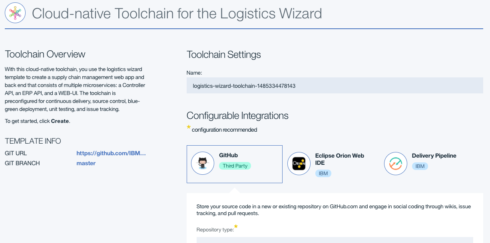

[Logistics Wizard](https://github.com/IBM-Cloud/logistics-wizard/tree/master#logistics-wizard-overview) / [Deploy](https://github.com/IBM-Cloud/logistics-wizard/tree/master#deploy-logistics-wizard) / logistics-wizard-toolchain

# Logistics Wizard Toolchain

This toolchain deploys the [Logistics Wizard](https://github.com/IBM-Cloud/logistics-wizard) sample application. Logistics Wizard is a supply chain management web application composed of several micro-services. Refer to the [Logistics Wizard home page](https://github.com/IBM-Cloud/logistics-wizard) for more information.

The toolchain is preconfigured to provide:
- issue tracking
- source control
- continuous delivery and integration (CI/CD)
- unit and code coverage testing
- blue-green deployment

## Create the toolchain

1. Ensure you have a [GitHub](https://github.com/) account.
2. Ensure you have an [IBM Cloud](https://ibm.com/cloud) account.
3. Ensure you have 2GB of free memory and space for 4 additional services in your IBM Cloud organization.
4. It is recommended to create a new space named `logistics-wizard` in your organization. This helps grouping the apps and services together in the console.
5. To create the toolchain, click this button:

  

## Configure the toolchain

After clicking the deployment button, the toolchain's configuration page is shown.

  

1. Provide a name **Toolchain name**. This name is used as the prefix for the deployed applications. The name must be unique within your organization.
2. Under **Tool Integrations** select the GitHub tab.
3. Choose to either **Clone** or **Fork** the Logistics Wizard's GitHub repositories.
4. Optionally change the GitHub **Repository Names** that will be created in your GitHub account.
5. Select the **Delivery Pipeline** tab.
6. Ensure the **App Name** for each microservice is unique.
7. Select the Cloud Foundry **Region**, **Organization** and **Space** where you want to deploy the application.
8. Paste your **IBM Cloud Platform API key** into the corresponding textbox. If you do not have an existing API key, create on using the `ibmcloud iam api-key-create <name>` command. Record the API key in a safe place; it will be shown only once after the command completes. 
9. The [coveralls](https://coveralls.io/) tokens remain empty. (These are used for IBM development.)
10. Click the **Create** button.

## Use the toolchain

Once the toolchain is created, several delivery pipelines corresponding to the microservices will also be created. Each microservice will have a production and delivery pipeline. Upon creation, the production pipelines will automatically begin.

1. Select each production (prod) **Delivery Pipeline** to ensure no failures have occurred.
2. Once all pipelines have successfully completed, visit the [walkthrough](https://github.com/IBM-Cloud/logistics-wizard/blob/master/WALKTHROUGH.md) for a tour of Logistics Wizard.
3. You can optionally start the development (dev) pipelines by clicking the pipeline and selecting the run button on the resulting page. This will deploy additional applications and services to support on-going development.

---
### Learn more

* [IBM Cloud Continuous Delivery](https://console.bluemix.net/docs/services/ContinuousDelivery/index.html#cd_getting_started)
* [IBM Cloud Toolchains Documentation](https://console.bluemix.net/docs/services/ContinuousDelivery/toolchains_about.html#toolchains_about)
